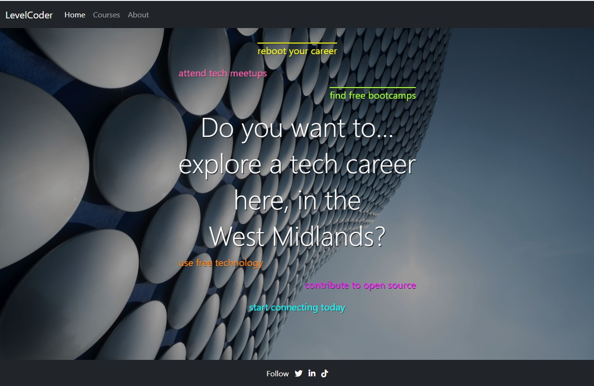
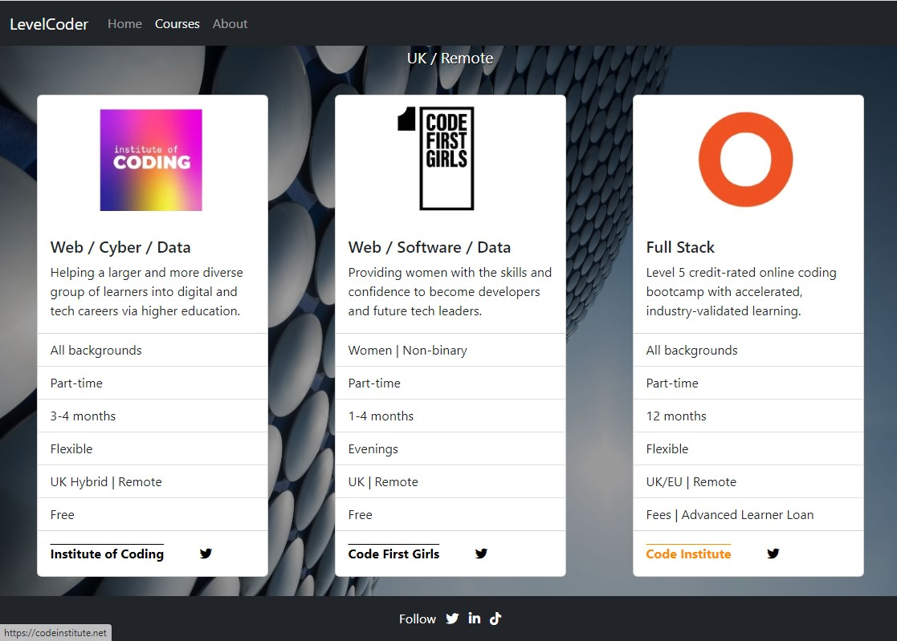
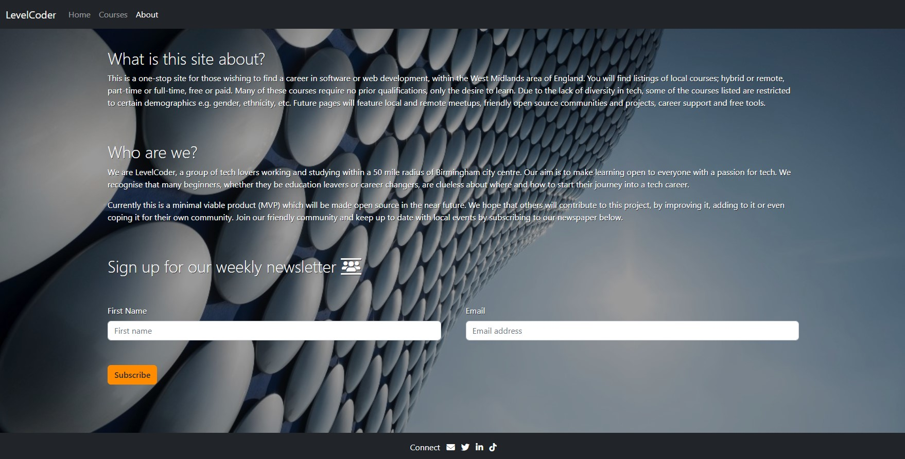
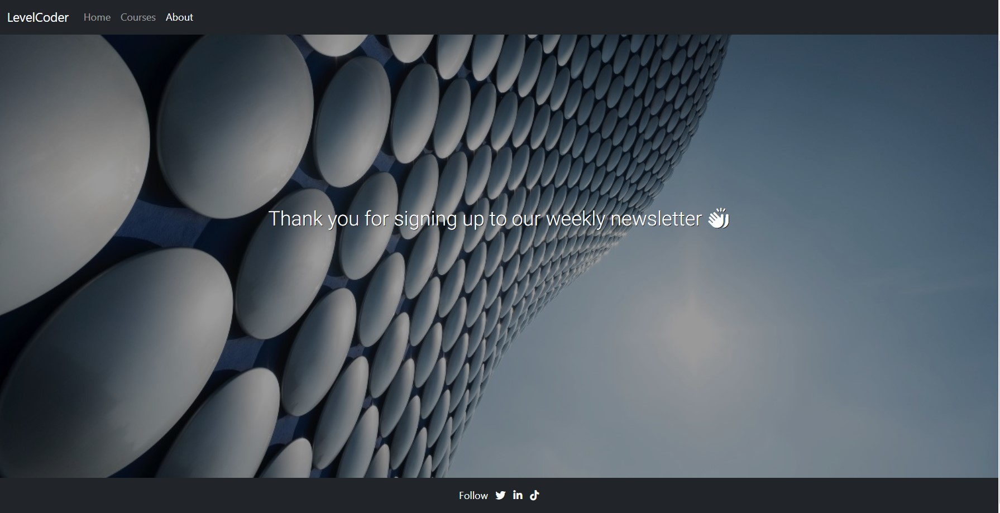
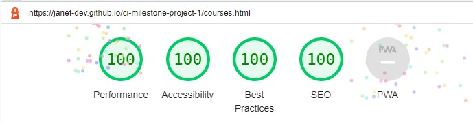
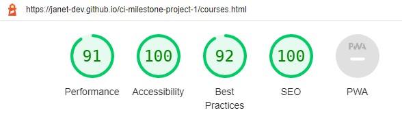
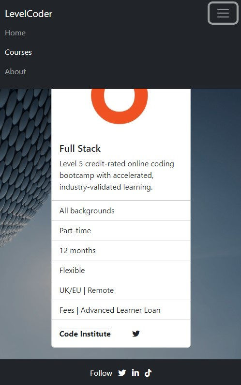
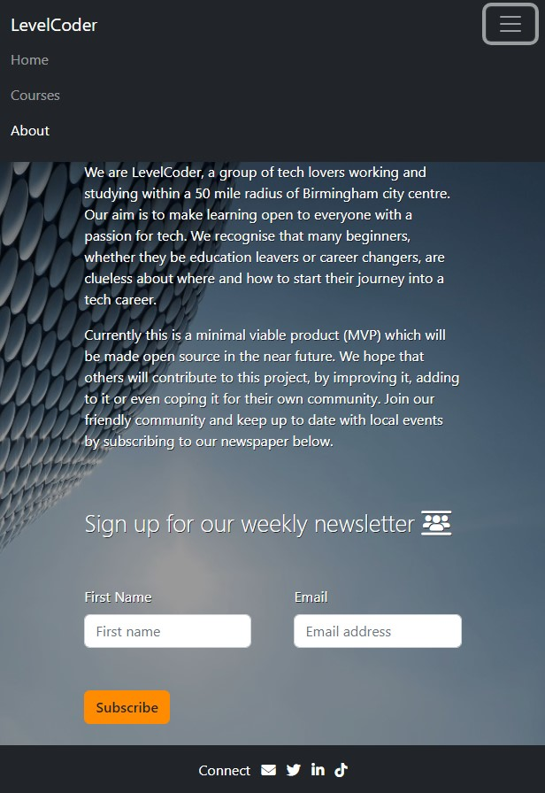
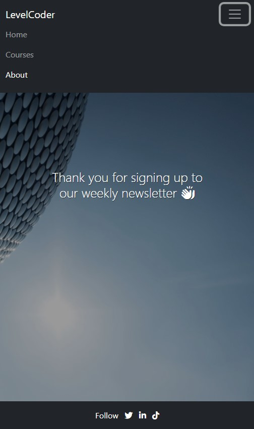

## Project Purpose
This is a Code Institute student project for Milestone 1, built to satisfy the requirements for the EKC DigitalLearn Diploma (Level 5) in [Web Application Development](https://www.ekcgroup.ac.uk/ekc-digitallearn/computing/web-application-development-diploma). 

This project has been created in order to display useful information on a deployed static website. The project was built using **Gitpod**.

The information has been presented in a way that ensures the users achieve their goals of:
* understanding what the site's function is
* finding appropriate technical courses
* being able to subscribe to our newsletter or email queries to us

The site also enhances the owner's goals by:
* paying back to the tech community
* showcasing their skills
* increasing their network
* contributing to the Open Source community

## Project Requirements
* The technologies used were HTML, CSS and **Bootstrap**.
* This static front end project contains three separate pages - Home, Courses and About/Contact
* A Bootstrap menu and footer is used for each page
* This README.md file explains what the project does and the value it provides for the users
* Version control is provided by Git and GitHub
* External code, libraries, templates, images, information, etc. will be listed in the **Credits**, at the bottom of this README.
* This project is deployed via GitHub Pages and the code in a GitHub repository.


<h1 align="center">LevelCoder - West Midlands, UK</h1>

[View the live project here.](https://janet-dev.github.io/ci-milestone-project-1/)

This is the first LevelCoder site to be created. It's main function is to serve as a one-stop information site for users in the West Midlands of England. The site will provide information on how users can start and maintain their path into a new career in tech. The first area covered will be: courses, local and remote, free and paid, full-time and part-time. 

The site is designed to be responsive and accessible on a range of devices, making it easy to navigate for potential users.

<h2 align="center"></h2>

## User Experience (UX)
### User personas
These user personas represent some of the possible target audience for this site - [view the PDF document](docs/ux/user-personas.pdf).

User personas help humanise the potential users. They depict their struggles, limitations, background and their goals. They give the designer yet another layer of information about the ethos of the project.

### User stories
As this is a brand new site with limited features, so the user stories were taken from the perspective of the visiting or anonymous user. We don't have any traffic data yet and we don't really know who are users are at this point.
* As a visiting user, I would like to connect with the company via their social media.
* As a visiting user, I would like to see if there are more advanced courses.
* As a visiting user, I would like to subscribe to a newsletter in order to receive current news about the site.

### Design
* Colour Scheme
    - Bootstrap's own white (#ffffff) text on dark grey (#212529) scheme is used for the navigation and footer sections.
    - Colours white (#ffffff) and dark grey (#212529) are used for text.
    - Orange (#ff8c00) is used as an extra indicator when hovering over links.

	This colour scheme was chosen for simplicity and readability. Too much colour can make the site to busy or distracting. Dark grey/white was chosen for the navigation and the odd pop of colour is provided by the CSS hover function.

* Typography
    - For the home and about pages, [Roboto font](https://fonts.google.com/specimen/Roboto) is used for good readability and contrast when required. It is considerd both [friendly and professional](https://xd.adobe.com/ideas/principles/web-design/best-modern-fonts-for-websites/), so should suit most sites. If this font is unavailable, san serif is used as a fallback.
* Imagery
    - The home page features the striking Selfridges Building, which defines Birmingham. This background image is both artistic and futuristic, and is used as the common background throughout the site. It was chosen to be a technical and friendly hero image.
    - On the courses page, each course is listed in it's own Bootstrap card, which features the providers own logo. This is supplied in order to build up trust and to ensure the users know which provider they are directed to from the site.

### Wireframes
See the site design as a [wireframe PDF](docs/ux/wireframe.pdf). It includes both desktop and mobile versions.

## Features
This website will initially consist of three visible pages (Home, Courses, About) and one hidden (Confirmation for subscription)

### Navigation
Navigation bar will be the default responsive Bootstrap one for all pages.
* Desktops 
    - [the menu](docs/pictures/nav-desktop.jpg) items: LevelCoder branding, Home, Courses, About will be inline and fixed across the top of the screen. The current page will have white text, while others will be in grey.
    - LevelCoder and Home will navigate to index.html, Courses to courses.html and About to about.html.

* Mobiles 
    - will feature the collapsed navigation with a toggler, which has a [dropdown menu](docs/pictures/nav-mobile.jpg) for each of the visible pages and again, the current page will have white text, while others will be in grey.

### Pages
* Home page - the user will introduced to the site and tempted to explore further. It will feature:
    - Coloured text, which introduces the user to the facilities of the site.
    - A hero image with opacity, to increase the contrast between the background and coloured text. 
    - Some texts will have [active links](docs/pictures/home-links.jpg), indicated with overlines (mainly for mobile viewing), to link to the appropriate pages. When these links are hovered over, they will change to white. Links for pages not yet built will be static coloured text. 
<h2 align="left"></h2>

* Courses page - here the user may find courses at all levels to further their objectives. 
    - Bootstrap cards are used to give a uniform display of the course details
        - Each card includes the following information:
            - course provider logo
            - subjects offered 
            - aim of the course 
            - who can apply, 
            - part or full-time 
            - duration 
            - flexibility 
            - location 
            - cost
            - links are supplied for the course provider and their social media accounts. These links will become orange when hovered over.
<h2 align="left"></h2>

* About page - the combined about and contact page will be composed of:

- Information about the site and why it was created.
- Information about the company.
- Form for subscribing to a weekly newsletter. Users will enter:
    - first name (last name is not required as the company does not collect unnecessary user data)
    - email address
    - select the Subscribe button to sign up to a regular email newsletter
    Both will be checked by the standard Bootstrap validation
    - Email link will be accessed via the [envelope icon](docs/pictures/about-footer.jpg) on the footer
<h2 align="left"></h2>

* Confirmation page is only visible on successful sign up to the newsletter and will contain the standard navigation and footer. Users will only be able to navigate from this page via the navigation bar, as the back button will be disabled.
<h2 align="left"></h2>

### Footer
[Footers](docs/pictures/footer.jpg) will feature:
* Social media links for Twitter, LinkedIn, TikTok on all pages, accessed via the appropriate icon. When hovered over they will change to orange.

* Email us facility accessed via the envelope icon, but only on the About page

## Future Features
After asking the advice of the [LinkedIn](https://www.linkedin.com/in/janetdornan/) and [codebar](https://codebar.io/) communities, further features are required:
* how to access career advice, network and where to find jobs
* how to join the tech community
* how to start contributing to open source projects
* where to find free products to use for design, development and deployment

After this project has been submitted, the features above will be implemented, as this will be an ongoing project to help those new to tech. The design of the project enables easy replication and the code will be made open source by applying the applicable licence and supporting documentation. Users can then modify the site, add to it or replicate for their own location or subject matter.

## Technology Used
* [HTML5](https://en.wikipedia.org/wiki/HTML5) and [CSS3](https://en.wikipedia.org/wiki/CSS) for building and custom styling the site.
* Wireframes from [Balsamiq](https://balsamiq.com/).
* Developer platform from [Gitpod](https://www.gitpod.io/).
* IDE integrated into Gitpod from [Visual Studio Code](https://code.visualstudio.com/).
* Bootstrap [Version 5.2.1](https://getbootstrap.com/docs/5.2/getting-started/introduction/).
* Debugging assisted by [Chrome Developer Tools](https://developer.chrome.com/docs/devtools/).
* Version control integrated into Gitpod from [Git](https://git-scm.com/).
* Project deployment provided by [GitHub Pages](https://pages.github.com/).
* Online cross browser and device testing by [LambdaTest](https://www.lambdatest.com/).
* HTML validation from [W3C](https://validator.w3.org/#validate_by_input).
* CSS validation from [Jigsaw (W3C)](https://jigsaw.w3.org/css-validator/#validate_by_input).
* Web page quality improvements assisted by [Lighthouse](https://developer.chrome.com/docs/lighthouse/overview/).
* Roboto font from [Google Fonts](https://fonts.google.com/).
* Icon library and toolkit from [Font Awesome](https://fontawesome.com/).
* Templates from [Figma](https://www.figma.com/)
* Online photo editor from [Pixlr](https://pixlr.com/x/).
* Stock photos from [Unsplash](https://unsplash.com).
* Paint from [Microsoft](https://apps.microsoft.com/store/detail/paint/9PCFS5B6T72H?hl=en-us&gl=us)
* Snip and Sketch from [Microsoft](https://apps.microsoft.com/store/detail/snipping-tool/9MZ95KL8MR0L?hl=en-gb&gl=gb)
* PDF Reader from [Adobe Acrobat Reader](https://www.adobe.com/uk/)

## Testing

**The site was built, tested and validated on the [Chrome browser](docs/pictures/chrome.jpg) only.**

### Supported Screen Sizes and Browsers

Bootstrap v5.2 was used for building the site - see the [supported browsers and devices](https://getbootstrap.com/docs/5.2/getting-started/browsers-devices/).
* Bootstrap supports the latest, stable releases of all major browsers and platforms:
    - Chrome >= 60
    - Firefox >= 60
    - Firefox ESR
    - iOS >= 12 (see bug 10 for issues)
    - Safari >= 12 (see bug 10 for issues)
    - Explorer <= 11
    - Edge - latest version

Unofficially, Bootstrap should look and behave well enough in Chromium and Chrome for Linux, and Firefox for Linux, though they are not officially supported. Proxy browsers (such as Opera Mini, Opera Mobile’s Turbo mode, UC Browser Mini, Amazon Silk) are not supported.

* Devices supported:
    - Mac
    - Windows
    - Android
    - iOS

* See the [six default breakpoints](https://getbootstrap.com/docs/5.2/layout/breakpoints/) provided by Bootstrap for responsive building. Each breakpoint was chosen to comfortably hold containers whose widths are multiples of 12. Breakpoints are also representative of a subset of common device sizes and viewport dimensions—they don’t specifically target every use case or device. Instead, the ranges provide a strong and consistent foundation to build on for nearly any device. 

    | Breakpoint               | Class          | Dimensions |
    | ------------------------ | -------------- | ---------- |
    | Extra small              | none           | <576px     |
    | Small                    | sm             | ≥576px     |
    | Medium                   | md             | ≥768px     |
    | Large                    | lg             | ≥992px     |
    | Extra large              | xl             | ≥1200px    |
    | Extra extra large        | xxl            | ≥1400px    |

Classes -md- and -lg- were specially defined for the courses page, where Bootstrap cards were utilised. Using these Bootstrap breakpoint classes helped to ensure smoother wrapping of the rows when different screen sizes were in operation.

### Code Validation
* HTML - No errors or warnings were detected by W3C Validation for pages:
    - [index.html PDF report](docs/testing/w3c-validation/w3c-html-index.pdf)
    - [courses.html PDF report](docs/testing/w3c-validation/w3c-html-courses.pdf)
    - [about.html PDF report](docs/testing/w3c-validation/w3c-html-about.pdf)
    - [confirmation.html PDF report](docs/testing/w3c-validation/w3c-html-confirm.pdf)

* CSS - No errors or warnings were detected by W3C Jigsaw Validation for:
    - [style.css PDF report](docs/testing/w3c-validation/w3c-css.pdf)

### Lighthouse
Lighthouse is an automated tool for improving the quality of web page. It checks the current webpage for performance, accessibility, best practices and SEO. 

The desktop audit scored 100 across the four features for all pages. Here is a typical summary:
<h2 align="left"></h2>

The mobile audit scored >90 across the four features for all pages. Here is the lowest-scored summary:
<h2 align="left"></h2>

index.html

- [Desktop PDF report](docs/testing/lighthouse-reports/lighthouse-index-desktop-2.pdf)
- [Mobile PDF report](docs/testing/lighthouse-reports/lighthouse-index-mobile-2.pdf)

courses.html

- [Desktop PDF report](docs/testing/lighthouse-reports/lighthouse-courses-desktop-2.pdf)
- [Mobile PDF report](docs/testing/lighthouse-reports/lighthouse-courses-mobile-2.pdf)

about.html

- [Desktop PDF report](docs/testing/lighthouse-reports/lighthouse-about-desktop-2.pdf)
- [MobilePDF report](docs/testing/lighthouse-reports/lighthouse-about-mobile-2.pdf)

confirmation.html

- [Desktop PDF report](docs/testing/lighthouse-reports/lighthouse-confirm-desktop.pdf)
- [Mobile PDF report](docs/testing/lighthouse-reports/lighthouse-confirm-mobile.pdf)

### Testing User Stories
* As a visiting user, I would like to connect with the company via their social media.
	- Upon visiting the Home page, the user is able to clearly see the company's [social media accounts on the footer](docs/pictures/home-desktop.jpg). The word *Follow* preceeds the well-know social media icons.
	- The [social media accounts](docs/pictures/footer.jpg) included are:
		- Twitter: users can follow and tag the company or share content. If the company follows the user back, then direct messaging is available.
		- LinkedIn: users can follow and tag the company or share content. If their connection requests are accepted, then direct messaging is available.
		- TikTok: users can follow the company or tag it in their video captions.
* As a visiting user, I would like to see if there are more advanced courses.
	- On the Courses page, the user is greeted by several [course cards](docs/pictures/courses.jpg), listing the course details. 
	- The user can choose from advanced several-month bootcamp courses to a year-long [Level 5 diploma](https://www.gov.uk/what-different-qualification-levels-mean/list-of-qualification-levels#).
* As a visiting user, I would like to [subscribe to a newsletter](docs/pictures/about.jpg) in order to receive current news about the site.
	- On the About page, the user is greeted with information about the site and it's creators. They are asked to subscribe to a weekly newsletter via a simple form.

### Further Testing
1. Testing and validation was carried out on the Chrome browser, though the site was viewed through others (including [Microsoft Edge](docs/pictures/edge.jpg)) to check the functionality of the site remained the same.

For further validation, viewed different browsers on other devices via [LambdaTest](https://www.lambdatest.com/), a cross browser online testing tool.

Performed a visual check on the following [devices and browsers](docs/pictures/lambda-log.jpg):

| Browser       | OS             | Device        | Result        |
| ------------- | -------------- | ------------- | ------------- |
| Safari        | [iOS 10.3](docs/pictures/lambda-safari-mobile-log.jpg)       | iPhone 5      | OK            | 
| Safari        | [macOS Catalina](docs/pictures/lambda-safari-desktop-log.jpg) | Desktop       | OK            |
| Opera         | [Android 11.0](docs/pictures/lambda-opera-mobile-log.jpg)   | Galaxy Tab A7 | OK            |
| Opera         | [Windows 10](docs/pictures/lambda-opera-desktop-log.jpg)     | Desktop       | OK            |
| Chromium      | [iOS 13.3](docs/pictures/lambda-chromium-mobile-log.jpg)       | iPhone 11     | OK            |
| Chrome        | [macOS Mojave](docs/pictures/lambda-chrome-desktop-log.jpg)   | Desktop       | OK            |

2. Colleagues from codebar, associates from LinkedIn and TechMids, plus friends and family members were asked to review the site and point out any bugs and/or user experience issues. 

### Bugs Fixed
1. To be consistant, [replaced all named and rgb colours with hex numbers](docs/pictures/bug-colour-hex.png) in style.css.
2. On every page, there was a [white space visible below the hero image](docs/pictures/bug-html-height.png). This was because the HTML height was greater than the viewport.
    - Fixed by making the HTML height the same as the viewport
    ```html
    html { 
        height: 100vh;
    }
    ```
3. On the courses page, the Bootstrap [cards were overlapping](docs/pictures/bug-overlap.png) on some screen sizes wilth the following code:
    ```html
    <div class="row">
        <div class="col-12 col-md-6 col-lg-3"></div>
    </div>
    ```
    - Fixed by changing the Bootstrap classes from .col-x to .row-cols-x. Used the responsive .row-cols-x classes to quickly set the number of columns that best rendered the content and layout. Found this to be better at responsiveness and it minimised the width compression of the cards, when shrinking from one breakpoint to another. Changed desktop layout to 3 cards in a row (.col-lg-3), because with 4, the card compression was more noticeable.
    ```html
    <div class="row row-cols-1 row-cols-md-2 row-cols-lg-3 g-3">
        <div class="col"></div>
    </div>
    ```
    See [Bootstrap cards](https://getbootstrap.com/docs/5.0/components/card/)
     and [Bootstrap grid with row columns.](https://getbootstrap.com/docs/5.0/layout/grid/#row-columns)
4. On the courses page, the [cards were not centered](docs/pictures/bug-card-not-centre.png) in their columns.
    - Fixed by displaying as flexbox and centering the contents
    ```css
    .col {
    display: flex;
    justify-content: center;
    }
    ```
5. On the courses page, depending on the card description, the cards could be unequal in length.
    - Fixed by adding class .h-100 to the cards. See [Bootstrap cards](https://getbootstrap.com/docs/5.0/components/card/#grid-cards).
    ```html
    <div class="card h-100">
    ```
6. On the courses page, there was no space between the [navigation bar](docs/pictures/bug-no-gap-fixed-navbar.png) or [footer](docs/pictures/bug-no-gap-footer-nav.png), and the cards.
    - Fixed by adding some padding to the page container
    ```css
    .courses-container {
    min-height: 100vh;
    height: auto;
    padding-top: 1.5rem;
    padding-bottom: 1.5rem;
    }
    ```
7. On the about page in mobile device mode, there was no space between the [text and navigation bar](docs/pictures/bug-no-gap-about-mobile.png), and between the [Subscribe button and footer](docs/pictures/bug-no-gap-about-btn.png).
    - Fixed by adding some padding
    ```css
    .about-h2 {
        padding-top: 1.5rem;
    }
    .btn-subscribe {
        padding-bottom: 1.5rem;
    }
    ```
8. Because some of the pages could become quite long, needed to fix the menu to the top of the viewport.
    - Implemented by making the navigation fixed at the top by the Bootstrap class .fixed-top. 
    [See Bootstrap navigation](https://getbootstrap.com/docs/5.0/components/navbar/#placement)
    ```html
    <nav class="navbar fixed-top navbar-expand-lg navbar-dark bg-dark"></nav>
    ```
    Unfortunately this covered some of the content at the top of the page, so extra padding-top was added:
    ```css
    .courses-container {
        min-height: 100vh;
        height: auto;
        padding-top: 4rem;
        padding-bottom: 1.5rem;
    }
    ```
9. On the about page, after clicking Subscribe button, the page refreshes. Would be better to give the user some  confirmation. Normally the [POST method](https://css-tricks.com/snippets/html/form-submission-new-window/) is used, but in this case there is nowhere to send the data and this [generates an error](docs/pictures/bug-post.jpg). Instead, used the [GET method](https://webmasters.stackexchange.com/questions/7958/can-i-post-to-a-new-window-that-i-want-to-open-up)
    - Implemented by opening another page using the form method of GET:
    ```html
    <form class="row g-5" method="GET" action="confirmation.html"></form>
    ```
10. On the *About* page, users are able to retrieve data from subscription form after submission by using the *back* button. This still happens if the code `method="GET" action="confirmation.html` is removed from the form element. Here the *Subscribe* button will default to Bootstrap submit actions, where the page refreshes and the data is cleared from the fields. By using the *back* button, the user can see the data.
    - This is a known issue which can be prevented by a Javascript script supplied by [Clue Mediator](https://www.cluemediator.com/how-to-disable-the-browser-back-button-using-javascript). It is placed in the *head* section of the HTML file where the user is being directed **from**, in this case the *about.html*. Inserted it under the *title* element:
    ```html
    <head>
        
        <title>About Page</title>
        <script type="text/javascript">
            function disableBack() { window.history.forward(); }
            setTimeout("disableBack()", 0);
            window.onunload = function () { null };
        </script>

    </head>
    ```
11. Flex column heading in courses.html was [not stretching across the whole screen](docs/pictures/bug-full-width.jpg) and forcing the course cards onto the next row. 
    - Solved by watching this [CSS Flexbox Tutorial](https://www.youtube.com/watch?v=M1yD8GVpLnQ)
    ```css
    	.full-width {
            flex-basis: 100%;
            text-align: center;
            z-index: 0;
    }
    ```
12. During the [initial Lighthouse audit](docs/pictures/bug-webp.jpg), it was suggested to use .webp images, so all images where changed from .jpg/.png format. Unfortunately not all browsers can display these .webp. Users with older devices may not be able to upgrade to the latest browsers. Found two devices [unable to view](docs/pictures/bug-safari-webp-missing.png) .webp images:
    - MacBook Pro running [macOS Catalina](docs/pictures/bug-safari-bg-grey.png) 10.15.5 with Safari 13.1.1
    - iPhone SE running iOS 13.6.1 
    - Fixed by [including a fallback](https://css-tricks.com/using-webp-images/) .jpg version of the .webp image:
    ```html
    <picture>
        <source srcset="assets/images/cyf-logo.webp" type="image/webp">
        <source srcset="assets/images/cyf-logo.jpg" type="image/jpg">
        
    </picture>
    ```
13. [Initial Lighthouse audit](docs/pictures/bug-no-ht-wd.jpg), showed that image sizes were not stated in the HTML, to prevent [layout shifts](https://web.dev/optimize-cls/?utm_source=lighthouse&utm_medium=devtools#images-without-dimensions) when a page is loading.
    - Fixed by including the width and height of the image - see the previous bug's code `width="358" height="200"`.
14. During the W3C validation of the about page, an error was raised because the [email query had spaces](docs/pictures/bug-mail-us.jpg) in it.
    - Fixed by removing spaces and inserting underscore where appropriate:
    ```html
    <a href="mailto:levelcoder.wm@gmail.com?subject=***Mail_via_LevelCoder_WestMids***&body=Dear_LevelCoder,"
                    target="_blank" rel="noopener noreferrer">
        <i class="fa-solid fa-envelope" aria-hidden="true"></i>
        <span class="sr-only">Email LevelCoder</span>
    </a>
    ```
15. Ran Lighthouse again for About page - performance was 86% for mobiles. Had an issue with an [unload event](docs/pictures/bug-unload.jpg). 
	- Solved issue by [replacing unload with pagehide](https://web.dev/bfcache/?utm_source=lighthouse&utm_medium=devtools#never-use-the-unload-event). Now performance is 98%.
	```html
	<script>
        function disableBack() {
            window.history.forward();
        }
        setTimeout("disableBack()", 0);
        window.onpagehide = function () {
            null
        };
    </script>
	```
#### Known Bugs
* Some images may appear compressed depending on the screen width. Bootstrap is designed to be mobile first and includes [six available breakpoints](https://getbootstrap.com/docs/5.2/layout/breakpoints/#available-breakpoints). 
	```
	Breakpoints are also representative of a subset of common device sizes and viewport dimensions—they don’t specifically target every use case or device. Instead, the ranges provide a strong and consistent foundation to build on for nearly any device.
	```
* On some mobile devices the hero image pushes the size of screen out, to show white gap on the right.

### Test Cases

These cases are included in order to help the next developer understand the design of the site and how to extend it. They document the look and functionality of each page.

#### Home Page
Desktop screen:

<h2 align="left"></h2>

Mobile screen:

<h2 align="left"></h2>


**Site View**

On any page, clicking or tapping *Home* or the white larger font *LevelCoder* text, on the top navigation bar, will take the user to index.html, the Home page.
The following features of the site are visible to the user.

* Desktop devices:
	- fixed top horizontal [navigation bar](docs/pictures/nav-desktop.jpg), with left-aligned active text in a horizontal list:
		- *LevelCoder* and *Home* links in white 
		- *Courses* and *About* in dark grey

	- hovering the mouse pointer over:
		- the top [navigation bar's dark grey links, will change them to light grey
		- the [coloured text links](docs/pictures/home-links.jpg), will change the text colour to white
		- the footer's white [social media icons](docs/pictures/footer.jpg), will change them to orange

* Mobile devices:
	- the Bootstrap [collapsed navigation](docs/pictures/nav-mobile-collapsed.jpg) with:
		- the white larger font LevelCoder text on the left  
		- the Bootstrap *toggler* or *hamburger* button (three small vertical lines stacked on top of each another inside a fine dark grey box) on the right 

* Desktop and mobile devices:
	- central white heading *Do you want to... explore a tech career here, in the West Midlands?* 
	- six coloured phrases surrounding the white heading 
	- two phrases with an overline, indicating active links
	- bottom horizonal footer with horizontally centrally-aligned white items:
		- the text *Follow* 
		- icons for Twitter, LinkedIn and TikToK.

**Site Actions**

When the user selects an active area of the screen, the following results will be seen.

* On the navigation area of desktop devices:
	1. Clicking or tapping on the white text *LevelCoder* will
		- refresh the page
		- cause no change in text behaviour.
	2. Clicking or tapping on the white text *Home* will
		- refresh the page
		- cause no change in text behaviour.
	3. Clicking or tapping on the dark grey text *Courses* will
		- change the text colour to light grey 
		- take the user to courses.html, the Courses page.
	4. Clicking or tapping on the dark grey text *About* will:
		- change the text colour to light grey 
		- take the user to about.html, the About and Contact page.

* On the navigation area of mobile devices:
	1. Tapping on the toggler will open a [dropdown menu](docs/pictures/nav-mobile.jpg) underneath the white *LevelCoder* text. The user will see:
		- the white *Home*, dark grey *Courses* and *About* texts in a vertical list 
		- toggler border will be thicker and light grey.
	2. Tapping on the white text *LevelCoder* will:
		- refresh the page
		- collapse the navigation
		- cause no change in text behaviour.
	3. Tapping on the white text *Home* will:
		- refresh the page
		- collapse the navigation
		- cause no change in text behaviour.
	4. Tapping on the dark grey *Courses* text will:
		- change the text colour to light grey
		- collapse the navigation
		- take the user to course.html, the Course page.
	5. Tapping on the dark grey *About* text will:
		- change the text colour to light grey 
		- collapse the navigation
		- take the user to about.html, the About page.
	6. When the navigation dropdown menu is visible, tapping on the toggler again, will collapse it. The togger will retain the thick light grey border until the user taps elsewhere on the screen, or the page is refreshed.

* On the page body area of desktop and mobile devices:
	1. Clicking or tapping the yellow *reboot your career* link will:
		- change the text colour to white 
		- take the user to the Courses page.
	2. Clicking or tapping the green *find free bootcamps* link will:
		- change the text colour to white 
		- take the user to the Courses page.

* On the footer area of desktop and mobile devices:
	1. Clicking or tapping the Twitter *bird* footer icon will:
		- change it's colour to orange 
		- take the user to the site's Twitter account in another tab.
	2. Clicking or tapping the LinkedIn *in* footer icon will:
		- change it's colour to orange 
		- take the user to the site's LinkedIn account in another tab.
	3. Clicking or tapping the TikTok *d* footer icon will:
		- change it's colour to orange 
		- take the user to the site's TikTok account in another tab.

#### Courses Page
Desktop screen:

<h2 align="left"></h2>

Mobile screen:

<h2 align="left"></h2>

**Site View**

On any page, clicking or tapping *Courses* , on the top navigation bar, will take the user to courses.html, the Courses page.
The following features of the site are visible to the user.

* Desktop devices:
	- fixed top horizontal navigation bar, with left-aligned active text ina horizontal list:
		- *LevelCoder* and *Courses* links in white 
		- *Home* and *About* in dark grey
	- hovering the mouse pointer over:
		- the top navigation bar's dark grey links, will change them to light grey
		- the footer's white social media icons, will change them to orange

* Mobile devices:
	- the Bootstrap collapsed navigation with:
		- the white larger font LevelCoder text on the left  
		- the Bootstrap *toggler* or *hamburger* button (three small vertical lines stacked on top of each another inside a fine dark grey box) on the right 

* Desktop and mobile devices:
	- central white heading *Local / Remote Courses* 
	- underneath the heading are five course cards, arranged as one to three course cards per row, depending on screen size
	- each card will display:
       		- course provider logo
            	- subjects offered 
            	- aim of the course 
            	- who can apply, 
            	- part or full-time 
            	- duration 
            	- flexibility 
            	- location 
            	- cost
            	- link for the course provider and an active social media icon
	- underneath these cards is a thin white line divider
	- underneath the divider is a central white heading *UK / Remote Courses*
	- underneath the heading are a further three course cards
	- bottom horizonal footer with horizontally centrally-aligned white items:
		- the text *Follow* 
		- icons for Twitter, LinkedIn and TikToK.

**Site Actions**

When the user selects an active area of the screen, the following results will be seen.

* On the navigation area of desktop devices:
	1. Clicking or tapping on the white text *LevelCoder* will
		- cause no change in text behaviour
		- take the user to index.html, the Home page.
	2. Clicking or tapping on the dark grey text *Home* will
		- change the text colour to light grey 
		- take the user to index.html, the Home page.
	3. Clicking or tapping on the white text *Courses* will
		- refresh the page
		- cause no change in text behaviour.
	4. Clicking or tapping on the dark grey text *About* will:
		- change the text colour to light grey 
		- take the user to about.html, the About and Contact page.

* On the navigation area of mobile devices:
	1. Tapping on the toggler will open a dropdown menu underneath the white *LevelCoder* text. The user will see:
		- the dark grey *Home*, white *Courses* and dark grey *About* texts in a vertical list 
		- toggler border will be thicker and light grey.
	2. Tapping on the white text *LevelCoder* will:
		- cause no change in text behaviour
        - collapse the navigation
		- take the user to index.html, the Home page.
	3. Tapping on the dark grey *Home* text will:
		- change the text colour to light grey
		- collapse the navigation
		- take the user to index.html, the home page.
	4. Tapping on the white text *Courses* will:
		- refresh the page
		- collapse the navigation
		- cause no change in text behaviour.
	5. Tapping on the dark grey *About* text will:
		- change the text colour to light grey 
		- collapse the navigation
		- take the user to about.html, the About page.
	6. When the navigation dropdown menu is visible, tapping on the toggler again, will collapse it. The togger will retain the thick light grey border until the user taps elsewhere on the screen, or the page is refreshed.

* On the page body and footer area of desktop and mobile devices:
	1. In the last field of each card, clicking or tapping the dark grey overlined *course provider* link will:
		- change the text colour to orange
		- take the user to the course provider's home page.
	2. In the last field of each card, clicking or tapping the dark grey *social media icon* link will:
		- change the text colour to orange
		- take the user to the course provider's social media account.

* On the footer area of desktop and mobile devices:
	1. Clicking or tapping the Twitter *bird* footer icon will:
		- change it's colour to orange 
		- take the user to the site's Twitter account in another tab.
	2. Clicking or tapping the LinkedIn *in* footer icon will:
		- change it's colour to orange 
		- take the user to the site's LinkedIn account in another tab.
	3. Clicking or tapping the TikTok *d* footer icon will:
		- change it's colour to orange 
		- take the user to the site's TikTok account in another tab.

#### About Page
Desktop screen:

<h2 align="left"></h2>

Mobile screen:

<h2 align="left"></h2>

**Site View**

On any page, clicking or tapping *About*, on the top navigation bar, will take the user to about.html, the About page.
The following features of the site are visible to the user.

* Desktop devices:
	- fixed top horizontal navigation bar, with left-aligned active text ina horizontal list:
		- *LevelCoder* and *About* links in white 
		- *Home* and *Courses* in dark grey
	- hovering the mouse pointer over:
		- the top navigation bar's dark grey links, will change them to light grey
		- the *Subscribe* button will change it from dark grey text on an orange background, to orange text on a dark grey background
		- the footer's white email and social media icons, will change them to orange

* Mobile devices:
	- the Bootstrap collapsed navigation with:
		- the white larger font LevelCoder text on the left  
		- the Bootstrap *toggler* or *hamburger* button (three small vertical lines stacked on top of each another inside a fine dark grey box) on the right 

* Desktop and mobile devices:
	- left justified white heading *What is this site about?* 
	- underneath the heading is a text paragraph
	- underneath the paragraph is another left justified white heading *Who are we?*
	- underneath the heading are another two text paragraphs
	- underneath the second paragraph is the heading *Sign up for our weekly newspaper*, followed by a *crowd* icon
	- underneath the heading is a form containing:
		- *First name* label above it's text input box
		- *Email address* label above it's text input box
		- orange *Subscribe* button		
	- bottom horizonal [footer](docs/pictures/about-footer.jpg) with horizontally centrally-aligned white items:
		- the text *Connect* 
		- icons for Emailing, Twitter, LinkedIn and TikToK.

**Site Actions**

When the user selects an active area of the screen, the following results will be seen.

* On the navigation area of desktop devices:
	1. Clicking or tapping on the white text *LevelCoder* will
		- cause no change in text behaviour
		- take the user to index.html, the Home page.
	2. Clicking or tapping on the dark grey text *Home* will
		- change the text colour to light grey 
		- take the user to index.html, the Home page.
	3. Clicking or tapping on the dark grey text *Courses* will:
		- change the text colour to light grey 
		- take the user to courses.html, the Courses page.
	4. Clicking or tapping on the white text *About* will
		- refresh the page
		- cause no change in text behaviour.

* On the navigation area of mobile devices:
	1. Tapping on the toggler will open a dropdown menu underneath the white *LevelCoder* text. The user will see:
		- the dark grey *Home*, white *Courses* and dark grey *About* texts in a vertical list 
		- toggler border will be thicker and light grey.
	2. Tapping on the white text *LevelCoder* will:
		- cause no change in text behaviour
        - collapse the navigation
		- take the user to index.html, the Home page.
	3. Tapping on the dark grey *Home* text will:
		- change the text colour to light grey
		- collapse the navigation
		- take the user to index.html, the home page.
	4. Tapping on the dark grey *Courses* text will:
		- change the text colour to light grey 
		- collapse the navigation
		- take the user to courses.html, the Courses page.
	5. Tapping on the white text *About* will:
		- refresh the page
		- collapse the navigation
		- cause no change in text behaviour.
	6. When the navigation dropdown menu is visible, tapping on the toggler again, will collapse it. The togger will retain the thick light grey border until the user taps elsewhere on the screen, or the page is refreshed.

* On the form area of desktop and mobile devices:
	1. Clicking or tapping on the input text boxes will:
		- the text box will have a thick semi-transparent light blue border
	2. Clicking or tapping on the *Subscribe* button will initiate the HTML basic error checking. Here are a few of the checks:
		- if no text is entered into [both input boxes](docs/pictures/form-error-both-clear.jpg): 
			- error message = *Please fill out this field.*

		- if at least one character is entered in to First name box, but [Email box:
			is clear](docs/pictures/form-error-email-clear.jpg):
			- error message = *Please fill out this field.* 

			- if any character/s [except @](docs/pictures/form-error-email-no-at.jpg) is entered:
				- error message = *Please include an @ in the email address. x is missing an @.*

			- if any character/s followed by @ then alpha-numeric character/s . alpha-numeric character/s entered:
				- [no error message](docs/pictures/form-check-min.jpg) and form is submitted. User is taken to confirmation.html.	

	Note: 	The default HTML valid email checker, whilst it is comprehensive, it does allow for non-standard email formats. In today's real world this should not be relied on. For further information see the specification published by [WHATWG](https://html.spec.whatwg.org/multipage/input.html#valid-e-mail-address)

* On the footer area of desktop and mobile devices:
	1. Clicking or tapping the Email *envelope* footer icon will:
		- change it's colour to orange 
		- take the user to their default email provider, where [fields will be pre-filled](docs/pictures/about-email.jpg):
			- From: user's email address
			- To: LevelCoder's email address
			- Subject: *Mail_via_LevelCoder_WestMids*
			- First line of email: *Dear_LevelCoder,*

	2. Clicking or tapping the Twitter *bird* footer icon will:
		- change it's colour to orange 
		- take the user to the site's Twitter account in another tab.
	3. Clicking or tapping the LinkedIn *in* footer icon will:
		- change it's colour to orange 
		- take the user to the site's LinkedIn account in another tab.
	4. Clicking or tapping the TikTok *d* footer icon will:
		- change it's colour to orange 
		- take the user to the site's TikTok account in another tab.

#### Confirmation Page
Desktop screen:

<h2 align="left"></h2>

Mobile screen:

<h2 align="left"></h2>

**Site View**

From the *About* page's form, clicking or tapping the *Subscribe* button, after entering valid name and email data -
the following features of the site are visible to the user.

* Desktop devices:
	- fixed top horizontal navigation bar, with left-aligned active text ina horizontal list:
		- *LevelCoder* and *About* links in white 
		- *Home* and *Courses* in dark grey
	- hovering the mouse pointer over:
		- the top navigation bar's dark grey links, will change them to light grey
		- the footer's white social media icons, will change them to orange

* Mobile devices:
	- the Bootstrap collapsed navigation with:
		- the white larger font LevelCoder text on the left  
		- the Bootstrap *toggler* or *hamburger* button (three small vertical lines stacked on top of each another inside a fine dark grey box) on the right 

* Desktop and mobile devices:
	- central white heading *Thank you for signing up to our weekly newsletter* followed by *clapping hands* icon
	- bottom horizonal footer with horizontally centrally-aligned white items:
		- the text *Follow* 
		- icons for Twitter, LinkedIn and TikToK.

**Site Actions**

When the user selects an active area of the screen, the following results will be seen.

* The first check to do, after the form submission has taken the user to the *Confirmation* page, is to click or tap the *back* button on the browser (see Bug 10.):
	 - the user should not be able to use the *back* button
	 - the user can only visit the other pages by using the navigation

* On the navigation area of desktop devices:
	1. Clicking or tapping on the white text *LevelCoder* will
		- cause no change in text behaviour
		- clear data from the form
		- take the user to index.html, the Home page.
	2. Clicking or tapping on the dark grey text *Home* will
		- change the text colour to light grey 
		- clear data from the form
		- take the user to index.html, the Home page.
	3. Clicking or tapping on the dark grey text *Courses* will:
		- change the text colour to light grey 
		- clear data from the form
		- take the user to courses.html, the Courses page.
	4. Clicking or tapping on the white text *About* will
		- cause no change in text behaviour
		- clear data from the form
		- take the user to about.html, the About and Contact page.

* On the navigation area of mobile devices:
	1. Tapping on the toggler will open a dropdown menu underneath the white *LevelCoder* text. The user will see:
		- the dark grey *Home*, white *Courses* and dark grey *About* texts in a vertical list 
		- toggler border will be thicker and light grey.
	2. Tapping on the white text *LevelCoder* will:
		- cause no change in text behaviour
		- collapse the navigation
		- clear data from the form
		- take the user to index.html, the Home page.
	3. Tapping on the dark grey *Home* text will:
		- change the text colour to light grey
		- collapse the navigation
		- clear data from the form
		- take the user to index.html, the home page.
	4. Tapping on the dark grey *Courses* text will:
		- change the text colour to light grey 
		- collapse the navigation
		- clear data from the form
		- take the user to courses.html, the Courses page.
	5. Tapping on the white text *About* will:
		- collapse the navigation
		- clear data from the form
		- cause no change in text behaviour.
		- take the user to about.html, the About and Contact page.
	6. When the navigation dropdown menu is visible, tapping on the toggler again, will collapse it. The togger will retain the thick light grey border until the user taps elsewhere on the screen, or the page is refreshed.

* On the footer area of desktop and mobile devices:
	1. Clicking or tapping the Twitter *bird* footer icon will:
		- change it's colour to orange 
		- take the user to the site's Twitter account in another tab.
	2. Clicking or tapping the LinkedIn *in* footer icon will:
		- change it's colour to orange 
		- take the user to the site's LinkedIn account in another tab.
	3. Clicking or tapping the TikTok *d* footer icon will:
		- change it's colour to orange 
		- take the user to the site's TikTok account in another tab.

## Deployment

### Gitpod LocalHost Deployment

1. To run a frontend (HTML, CSS, Javascript only) application in Gitpod, [in the terminal](docs/pictures/deploy-python.jpg), type:
	```python
	python3 -m http.server
	```
2. A blue button should appear to click: [_Make Public_](docs/pictures/deploy-port-8000.jpg),
3. Another similar blue button should appear to click: _Open Browser_. If this is not seen, click on the:
	* [_Ports icon_](docs/pictures/deploy-port-browser.jpg) **1** then the port address or globe icon **2** to run the project in a new browser tab.

The ports can also be accessed via the bottom blue banner, where it shows [_Ports: 8000_](docs/pictures/deploy-open-port.jpg)

In Gitpod you have superuser security privileges by default. Therefore you do not need to use the `sudo` (superuser do) command in the bash terminal.

### GitHub Pages

The project was deployed to GitHub Pages using the following steps...

1. Log in to GitHub and locate the [GitHub Repository](https://github.com/)
	- [See the screenshot](docs/pictures/github1.jpg)
2. At the top of the Repository (not top of page), locate the ["Settings" Button](docs/pictures/github2.jpg) on the menu.
3. Scroll down the Settings page until you locate the ["Pages" Section](docs/pictures/github3.jpg) on the left hand side.
4. Under "Branch", click the dropdown called "None" and [select "main"](docs/pictures/github4.jpg).
5. Branch section should look like [this screenshot](docs/pictures/github5.jpg). Wait a few minutes for the page to automatically refresh.
6. Scroll back to top of the page to locate the now published site in the ["GitHub Pages" section](docs/pictures/github6.jpg). Copy this link.
7. Go back to your repository and select the [Setting gear icon](docs/pictures/github7.jpg) to the right of "About".
8. Paste your url into the [box under "Website"](docs/pictures/github8.jpg) and click the "Save Changes" button.
9. You now have a [link for everyone](docs/pictures/github9.jpg) to use from your repository.

### Forking the GitHub Repository

By forking the GitHub Repository we make a copy of the original repository on our GitHub account to view and/or make changes without affecting the original repository by using the following steps...

1. Log in to GitHub and locate the [GitHub Repository](https://github.com/)
2. At the top of the Repository (not top of page) just above the "Settings" Button on the menu, locate the "Fork" Button.
3. You should now have a copy of the original repository in your GitHub account.

### Making a Local Clone

1. Log in to GitHub and locate the [GitHub Repository](https://github.com/)
2. Under the repository name, click "Clone or download".
3. To clone the repository using HTTPS, under "Clone with HTTPS", copy the link.
4. Open Git Bash
5. Change the current working directory to the location where you want the cloned directory to be made.
6. Type `git clone`, and then paste the URL you copied in Step 3.

```
$ git clone https://github.com/YOUR-USERNAME/YOUR-REPOSITORY
```

7. Press Enter. Your local clone will be created.

```
$ git clone https://github.com/YOUR-USERNAME/YOUR-REPOSITORY
> Cloning into `CI-Clone`...
> remote: Counting objects: 10, done.
> remote: Compressing objects: 100% (8/8), done.
> remove: Total 10 (delta 1), reused 10 (delta 1)
> Unpacking objects: 100% (10/10), done.
```

Click [Here](https://help.github.com/en/github/creating-cloning-and-archiving-repositories/cloning-a-repository#cloning-a-repository-to-github-desktop) to retrieve pictures for some of the buttons and more detailed explanations of the above process.

## Credits

A huge thank you to the following people and organisations, because without you, the website would not have been produced in it's present form.

### From the Course

Sample README and GitHub deployment instructions from [Code Institute](https://github.com/Code-Institute-Solutions/SampleREADME)

Markdown Cheatsheet from [Adam Pritchard](https://github.com/adam-p/markdown-here/wiki/Markdown-Cheatsheet#html)

### Media

Figma Community: User Persona Template by [Ikechukwu Okonkwo](https://www.figma.com/@iykee)

The 7 Best Modern Fonts for Websites by [Justin Morales ](https://xd.adobe.com/ideas/principles/web-design/best-modern-fonts-for-websites/)

Choose the Best Color Combinations for Your Website by [Jimdo](https://www.jimdo.com/blog/best-color-combinations-for-your-website/)

Woman in front of a lit wall by [Josh Hild](https://unsplash.com/@joshhild) on Unsplash

Selfridges Building in Birmingham by [Christian Holzinger](https://unsplash.com/@pixelatelier) on Unsplash

Course provider icons -  see the [Courses page](https://janet-dev.github.io/ci-milestone-project-1/courses.html)

### Code
Although the code is the work of the author, some of the code has been sourced from or inspired by others.

Many of the references have been embedded as links throughout this document and indicated by the active blue text links.

[Bootstrap 5.2](https://getbootstrap.com/docs/5.2/getting-started/introduction/)

[Creating a hero image with opaque layer](https://github.com/Code-Institute-Solutions/whiskey-drop) by Code Institute's Whiskey Drop tutorial

[How to create a Jumbotron in Bootstrap 5](https://www.studytonight.com/bootstrap/how-to-create-a-jumbotron-in-bootstrap-5) by Study Tonight

[Bootstrap 5 gutters : Space between columns](https://cutekit.net/2021/02/15/bootstrap-5-gutters-space-between-columns/) by Miradontsoa Andrianarison

[HTML meta Tag](https://www.w3schools.com/tags/tag_meta.asp) by W3Schools

[How to Make One Flex Item Full-Width - CSS Flexbox Tutorial](https://www.youtube.com/watch?v=M1yD8GVpLnQ) by Front End Beginners

[Simple Styles for hr's](https://css-tricks.com/examples/hrs/) by CSS Tricks

[Using WebP Images](https://css-tricks.com/using-webp-images/) by Jeremy Wagner

[Optimize Cumulative Layout Shift](https://web.dev/optimize-cls/?utm_source=lighthouse&utm_medium=devtools#images-without-dimensions) by Addy Osmani

[Form Submission Opens New Tab/Window](https://css-tricks.com/snippets/html/form-submission-new-window/) by Chris Coyier

[Can I POST to a new window that I want to open up?](https://webmasters.stackexchange.com/questions/7958/can-i-post-to-a-new-window-that-i-want-to-open-up) solution by [Bavi_H](https://webmasters.stackexchange.com/users/3108/bavi-h)

[How to disable the browser back button](https://www.cluemediator.com/how-to-disable-the-browser-back-button-using-javascript) by Clue Mediator

[Never use the unload event](https://web.dev/bfcache/?utm_source=lighthouse&utm_medium=devtools#never-use-the-unload-event) by Philip Walton and Barry Pollard

## Acknowledgements

Rohit Sharma - [Code Institute](https://codeinstitute.net/) Mentor, for the continuous feedback and guidance in industry standards.

Rachel Furlong - [EKC DigitalLearn](https://ekcgroup.ac.uk/business-units/ekc-digitallearn) Course Facilitator, for generous support and advice.
 
