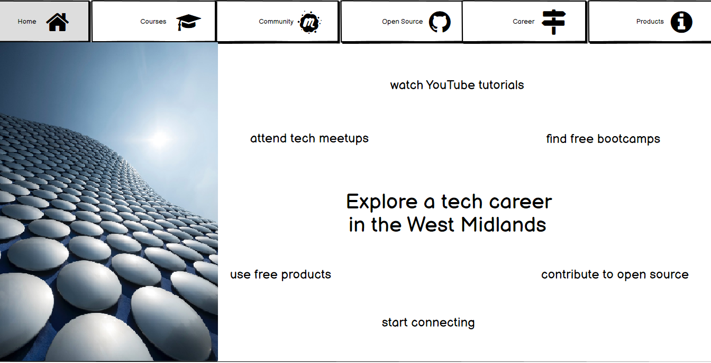
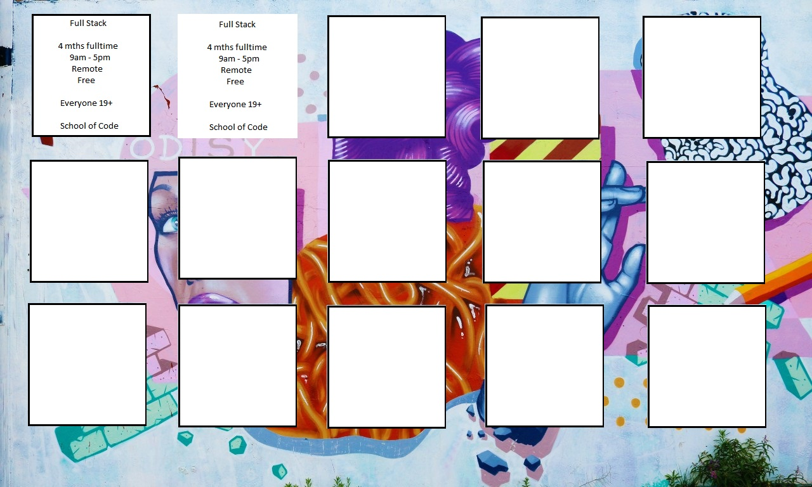

Welcome!

This is a Code Institute student project for Milestone 1, built to satisfy the requirements for the EKC DigitalLearn Diploma (Level 5) in [Web Application Development](https://www.ekcgroup.ac.uk/ekc-digitallearn/computing/web-application-development-diploma). 

## Project Purpose
This project has been created in order to display useful information on a deployed static website. The project was built using **Gitpod**.

The information has been presented in a way that ensures the users achieve their goals of:
* understanding what the site's function is
* finding appropriate technical courses
* being able to subscribe to our newsletter or email queries to us

The site also enhances the owner's goals by:
* paying back to the tech community
* showcasing their skills
* increasing their network
* contributing to the Open Source community

## Project Requirements
* The technologies used were HTML, CSS and **Bootstrap**.
* This static front end project contains three separate pages - Home, Courses and About/Contact
* A Bootstrap menu and footer is used for each page
* This README.md file explains what the project does and the value it provides for the users
* Version control is provided by Git and GitHub
* External code, libraries, templates, images, information, etc. will be listed in the **Credits**, at the bottom of this README.
* This project is deployed via GitHub Pages and the code in a GitHub repository.

<h1 align="center">LevelCoder - West Midlands, UK</h1>

[View the live project here.](https://janet-dev.github.io/ci-project-1-level-coder/)

This is the first LevelCoder site to be created. It's main function is to serve as a one-stop information site for users in the West Midlands of England. The site will provide information on how users can start and maintain their path into a new career in tech. The first area covered will be: courses, local and remote, free and paid, full-time and part-time. 

The site is designed to be responsive and accessible on a range of devices, making it easy to navigate for potential users.

<h2 align="center"></h2>

## User stories

-   **Maria:**
    “I want a job that I love and to give my daughter a better future”

    - Demographics

        * Age: 28
        * Education: College
        * Location: Coventry
        * Family: Single parent
        * Occupation: Server
    
    - Brief Story

        Maria is a refugee and works in a cafe. She took online tech courses back home, but has only recently started attending workshops, after 2 years away from her studies. Her go-to social media app is WhatsApp as she can easily (and for free) contact friends and family back home. She currently does not use LinkedIn or Twitter, but has Facebook and an inactive Github account. Maria and her daughter live with their host family in Coventry. She is a sociable person in real life and likes to bake cakes for her friends.

    - Goals

        * Continue web development studies
        * Start freelancing
        * Find a job in tech

    - Frustrations

        * Work leaves her physically and mentally drained. She has no energy for studying or research. Language is a barrier and she is unsure how to navigate her way into tech.

-   **Andrew:**
    “I want the freedom to create products that I designed”

    - Demographics

        * Age: 35
        * Education: University
        * Location: London
        * Family: Single
        * Occupation: Accountant
    
    - Brief Story

        Andrew is a qualified accountant, but looking to change his career. He has a good job, no mortgage and has plenty of disposible income. He has completed some online courses in JavaScript and is on the look out for a suitable full stack bootcamp. He is active on LinkedIn and Slack. He is a new codebar student.

    - Goals

        * Change career to software development
        * Move back to Birmingham
        * Connect with other tech lovers

    - Frustrations

        * Continually hitting career obstacles at work and not being allowed to grow. Does not know many people in Birmingham now.

-   **Nikki:**
    “In the future I may also build websites for other photographers”

    - Demographics

        * Age: 20
        * Education: College
        * Location: Birmingham
        * Family: Single
        * Occupation: Photographer
    
    - Brief Story

        Nicki lives at home with her parents, works part time in a local hotel and has just graduated from college with a diploma in photography. She has just completed her first freelance job and would now like to build her own website. She is active on Facebook and Instagram, but not on Twitter or LinkedIn. She is looking for an easy to follow YouTube tutorial in web development.

    - Goals

        * Build own business website
        * Grow own freelance business
        * Earn enough to leave hospitality

    - Frustrations

        * No code sites like Wix are not flexible enough. Finding suitable web development tutorials is difficult because there are so many.

-   **Mo:** 
    “I want wake up every morning, full of joy for my work and life”

    - Demographics

        * Age: 49
        * Education: University
        * Location: Solihull
        * Family: Married, Children
        * Occupation: Engineer
    
    - Brief Story

        Mo has a mortgage and was made redundant from his last job, but now works as a bookshop assistant. He has started his career change by completing a recent 3 month government backed bootcamp in data. He now wants to concentrate in Python programming and SQL. He has attended a few tech meetups in Birmingham and is active on LinkedIn and Twitter. He is looking to start venturing into open source projects in order to give him that edge over younger candidates.

    - Goals

        * Change career to backend developer
        * Gain a role in tech
        * Earn enough to leave retail

    - Frustrations

        * Been seen as too old and finding the recruitment process draining

## Features
This website will initially consist of three pages:
* Home -  the user will introduced to the site and tempted to explore further. All the user stories showed a desire to either get a role in tech or find out how to use it in order to build a product.

<h2 align="left"></h2>

* Courses - here the user may find courses and tutorials to further their objectives. 

    For example, Maria has limited funds, a dependent and a part time job. She has limited English and very little knowledge of how to start upskilling herself. She may find that a part time free bootcamp for refugees in Birmingham, with Saturday workshops, a viable option. 

    Andrew wants a bootcamp and can afford to purchase one and/or take time out to attend a full time one. He will find both in Birmingham. It should also be noted that these local courses, often have employment partners willing to employ the course graduates or offer intern roles. 

    Nikki wants a free one-stop video tutorial and YouTube would be a likely option. 

    Mo, on the other hand, does not seem to be on the look out or a course. He is a mature student who graduated years ago in engineering. He may find that a qualification with a government learner loan or a free computer science course will incease his hiring chances.

* About and Contact - The site also publishes an email newsletter in order to keep users informed of upcoming developments either with the site or the West Midlands tech scene. Users will be encouraged to contribute to the site, they may have suggestions, modifications or some queries about the community in general. The site will open source so that anyone, whether they be new or experienced, may improve the site, extend it or copy it for their own use in another area, by location or subject. This page includes a subscription form and an email link.

### Navigation
### Pages
### Footer

## Future Features
The user stories above have identified a need for further pages:
* how to access career advice, network and where to find jobs
* how to join the tech community
* how to start contributing to open source projects
* where to find free products to use for design, development and deployment

## Typography and Colour Schemes
* Font: Roboto for best readability and Exo for contrast when required
* Navigation and footer: Dark grey with white text
* Body of course page: background image featuring Birmingham street graffiti with white text boxes positioned on a grid
<h2 align="left"></h2>

## Wireframes

## Technology Used

## Testing
### Code Validation
### Test Cases
### Bugs Fixed
### Supported Screen Sizes and Browsers

## Deployment
### Gitpod Reminders

To run a frontend (HTML, CSS, Javascript only) application in Gitpod, in the terminal, type:

`python3 -m http.server`

A blue button should appear to click: _Make Public_,

Another blue button should appear to click: _Open Browser_.

To run a backend Python file, type `python3 app.py`, if your Python file is named `app.py` of course.

A blue button should appear to click: _Make Public_,

Another blue button should appear to click: _Open Browser_.

In Gitpod you have superuser security privileges by default. Therefore you do not need to use the `sudo` (superuser do) command in the bash terminal in any of the lessons.

### GitHub Pages

## Credits

A huge thank you to the following people and organisations, because without you, the website would not have been produced in it's present form.

### From the Course
Rachel Furlong - EKC DigitalLearn Course Facilitator
 
Rohit Sharma - Code Institute Mentor

### Technologies

Figma Community: User Personna Template by [Ikechukwu Okonkwo](https://www.figma.com/@iykee)

Wireframes from [Balsamiq](https://balsamiq.com/)

Developer platform from [Gitpod](https://www.gitpod.io/)

Bootstrap [Version 5.2](https://getbootstrap.com/docs/5.2/getting-started/introduction/)

Icon library and toolkit from [Font Awesome](https://fontawesome.com/)

### Images

Woman in front of a lit wall by [Josh Hild](https://unsplash.com/@joshhild) on Unsplash

Selfridges Building in Birmingham by [Christian Holzinger](https://unsplash.com/@pixelatelier) on Unsplash

Graffiti from Digbeth in Birmingham by [Creative Nerds](https://unsplash.com/@creativenerds) on Unsplash

