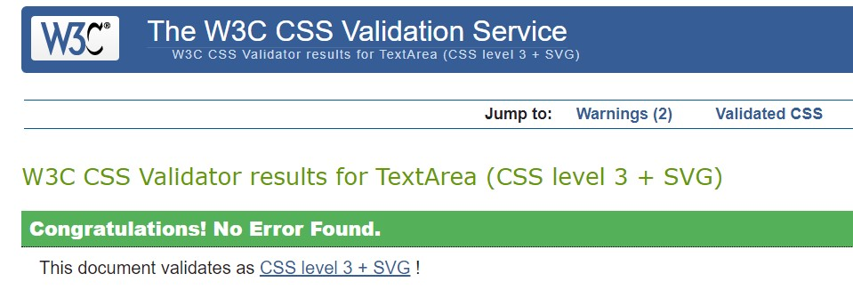
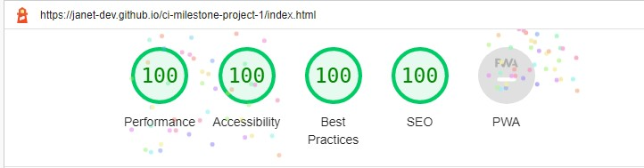
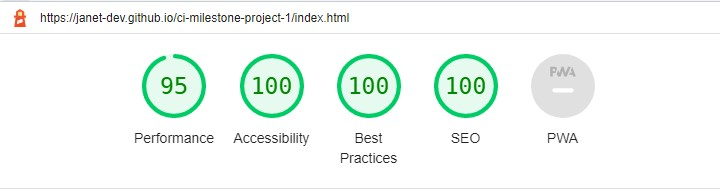
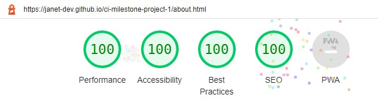
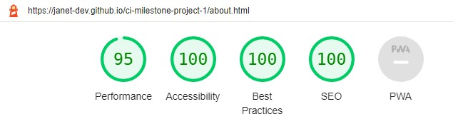
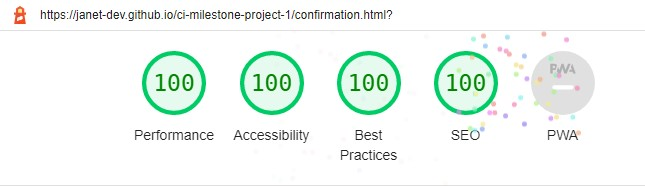

## Project Purpose
This is a Code Institute student project for Milestone 1, built to satisfy the requirements for the EKC DigitalLearn Diploma (Level 5) in [Web Application Development](https://www.ekcgroup.ac.uk/ekc-digitallearn/computing/web-application-development-diploma). 

This project has been created in order to display useful information on a deployed static website. The project was built using **Gitpod**.

The information has been presented in a way that ensures the users achieve their goals of:
* understanding what the site's function is
* finding appropriate technical courses
* being able to subscribe to our newsletter or email queries to us

The site also enhances the owner's goals by:
* paying back to the tech community
* showcasing their skills
* increasing their network
* contributing to the Open Source community

## Project Requirements
* The technologies used were HTML, CSS and **Bootstrap**.
* This static front end project contains three separate pages - Home, Courses and About/Contact
* A Bootstrap menu and footer is used for each page
* This README.md file explains what the project does and the value it provides for the users
* Version control is provided by Git and GitHub
* External code, libraries, templates, images, information, etc. will be listed in the **Credits**, at the bottom of this README.
* This project is deployed via GitHub Pages and the code in a GitHub repository.


<h1 align="center">LevelCoder - West Midlands, UK</h1>

[View the live project here.](https://janet-dev.github.io/ci-milestone-project-1/)

This is the first LevelCoder site to be created. It's main function is to serve as a one-stop information site for users in the West Midlands of England. The site will provide information on how users can start and maintain their path into a new career in tech. The first area covered will be: courses, local and remote, free and paid, full-time and part-time. 

The site is designed to be responsive and accessible on a range of devices, making it easy to navigate for potential users.

<h2 align="center"></h2>

## User stories
* As a visiting user, I would like to connect with the company via their social media.
* As a visiting user, I would like to see if there are more advanced courses.
* As a visiting user,  I would like to subscribe to a newsletter in order to receive current news about the site.

## Design
* Colour Scheme
    - Bootstrap's own white (#ffffff) text on dark grey (#212529) scheme is used for the navigation and footer sections.
    - Colours white (#ffffff) and dark grey (#212529) are used for text.
    - Orange (#ff8c00) is used as an extra indicator when hovering over links.
* Typography
    - For the home and about pages, Roboto font is used for the main headings for good readability and text contrast when required. This was chosen for best readability. If this font is unavailable, san serif is used as a fallback.
* Imagery
    - The home page features the striking Selfridges Building, which defines Birmingham. This background image is both artistic and futuristic, and is used as the common background throughout the site. It was chosen to be a technical and friendly hero image.
    - On the courses page, each course is listed in it's own Bootstrap card, which features the providers own logo. This is supplied in order to build up trust and to ensure the users know which provider they are directed to from the site.

## Wireframes
See the site design as a [wireframe PDF](docs/wireframe/wireframe.pdf). It includes both desktop and mobile versions.

## Features
This website will initially consist of three visible pages (Home, Courses, About) and one hidden (Confirmation for subscription)

### Navigation
Navigation bar will be the default responsive Bootstrap one for all pages.
* Desktops 
    - [the menu](docs/pictures/nav-desktop.jpg) items: LevelCoder branding, Home, Courses, About will be inline and fixed across the top of the screen. The current page will have white text, while others will be in grey.
    - LevelCoder and Home will navigate to index.html, Courses to courses.html and About to about.html.

* Mobiles 
    - will feature the collapsed navigation with a toggler, which has a [dropdown menu](docs/pictures/nav-mobile.jpg) for each of the visible pages and again, the current page will have white text, while others will be in grey.

### Pages
* Home page - the user will introduced to the site and tempted to explore further. It will feature:
    - Coloured text, which introduces the user to the facilities of the site.
    - A hero image with opacity, to increase the contrast between the background and coloured text. 
    - Some texts will have [active links](home-links.jpg), indicated with overlines (mainly for mobile viewing), to link to the appropriate pages. When these links are hovered over, they will change to white. Links for pages not yet built will be static coloured text. 
<h2 align="left"></h2>

* Courses page - here the user may find courses at all levels to further their objectives. 
    - Bootstrap cards are used to give a uniform display of the course details
        - Each card includes the following information:
            - course provider logo
            - subjects offered 
            - aim of the course 
            - who can apply, 
            - part or full-time 
            - duration 
            - flexibility 
            - location 
            - cost
            - links are supplied for the course provider and their social media account. These links will become orange when hovered over.
<h2 align="left"></h2>

* About and Contact page 
The combined About and Contact page will be composed of:

- Information about the site and why it was created.
- Information about the company.
- Form for subscribing to a weekly newsletter. Users will enter:
    - first name (last name is not required as the company does not collect unnecessary user data)
    - email address
    - select the Subscribe button to sign up to a regular email newsletter
    Both will be checked by the standard Bootstrap validation
    - Email link will be accessed via the [envelope icon](docs/pictures/about-footer.jpg) on the footer
<h2 align="left"></h2>

* Confirmation page is only visible on successful sign up to the newsletter and will contain the standard navigation and footer.
<h2 align="left"></h2>

### Footer
[Footers](docs/pictures/footer.jpg) will feature:
* Social media links for Twitter, LinkedIn, TikTok on all pages, accessed via the appropriate icon. When hovered over they will change to orange.

* Email us facility accessed via the envelope icon, but only on the About page

## Future Features
After asking the advice of the LinkedIn and codebar communities, further features are required:
* how to access career advice, network and where to find jobs
* how to join the tech community
* how to start contributing to open source projects
* where to find free products to use for design, development and deployment

## Technology Used
* [HTML5](https://en.wikipedia.org/wiki/HTML5) and [CSS3](https://en.wikipedia.org/wiki/CSS) for building and custom styling the site.
* Wireframes from [Balsamiq](https://balsamiq.com/).
* Developer platform from [Gitpod](https://www.gitpod.io/).
* IDE integrated into Gitpod from [Visual Studio Code](https://code.visualstudio.com/).
* Bootstrap [Version 5.2.1](https://getbootstrap.com/docs/5.2/getting-started/introduction/).
* Debugging assisted by [Chrome Developer Tools](https://developer.chrome.com/docs/devtools/).
* Version control integrated into Gitpod from [Git](https://git-scm.com/).
* Project deployment provided by [GitHub Pages](https://pages.github.com/).
* HTML validation from [W3C](https://validator.w3.org/#validate_by_input).
* CSS validation from [Jigsaw (W3C)](https://jigsaw.w3.org/css-validator/#validate_by_input).
* Web page quality improvements assisted by [Lighthouse](https://developer.chrome.com/docs/lighthouse/overview/).
* Roboto font from [Google Fonts](https://fonts.google.com/).
* Icon library and toolkit from [Font Awesome](https://fontawesome.com/).
* Online photo editor from [Pixlr](https://pixlr.com/x/).
* Stock photos from [Unsplash](https://unsplash.com).

## Testing
Testing and validation was carried out on the **Chrome** browser only, though the site was viewed through others for a quick check.

### Code Validation
* HTML - No errors or warnings were detected by W3C Validation for pages:
    - [index](docs/testing/w3c-validation/w3c-html-index.pdf)
    - [courses](docs/testing/w3c-validation/w3c-html-courses.pdf)
    - [about](docs/testing/w3c-validation/w3c-html-about.pdf)
    - [confirmation](docs/testing/w3c-validation/w3c-html-confirm.pdf)
<h2 align="left"></h2>

* CSS - No errors or warnings were detected by W3C Jigsaw Validation for:
    - [style](docs/testing/w3c-validation/w3c-css.pdf)
<h2 align="left"></h2>

### Lighthouse
Lighthouse is an automated tool for improving the quality of web page. It checks the current webpage for performance, accessibility, best practices and SEO. A summary for the performance of each page is provided here:

index.html

- Desktop - see the detailed [PDF report](docs/testing/lighthouse-reports/lighthouse-index-desktop-2.pdf) for more information.
<h2 align="left"></h2>

- Mobile - see the detailed [PDF report](docs/testing/lighthouse-reports/lighthouse-index-mobile-2.pdf) for more information.
<h2 align="left"></h2>

courses.html

- Desktop - see the detailed [PDF report](docs/testing/lighthouse-reports/lighthouse-courses-desktop-2.pdf) for more information.
<h2 align="left"></h2>

- Mobile - see the detailed [PDF report](docs/testing/lighthouse-reports/lighthouse-courses-mobile-2.pdf) for more information.
<h2 align="left"></h2>

about.html

- Desktop - see the detailed [PDF report](docs/testing/lighthouse-reports/lighthouse-about-desktop-2.pdf) for more information.
<h2 align="left"></h2>

- Mobile - see the detailed [PDF report](docs/testing/lighthouse-reports/lighthouse-about-mobile-2.pdf) for more information.
<h2 align="left"></h2>

confirmation.html

- Desktop - see the detailed [PDF report](docs/testing/lighthouse-reports/lighthouse-confirm-desktop-2.pdf) for more information.
<h2 align="left"></h2>

- Mobile - see the detailed [PDF report](docs/testing/lighthouse-reports/lighthouse-confirm-mobile-2.pdf) for more information.
<h2 align="left"></h2>

### Bugs Fixed
1. To be consistant, replaced all named and rgb colours with hex numbers in style.css.
2. On every page, there was a white space visible below the hero image. This was because the HTML height was greater than the viewport.
    - Fixed by making the HTML height the same as the viewport
    ```html
    html { 
        height: 100vh;
    }
    ```
3. On the courses page, the Bootstrap were overlapping on some screen sizes wilth the following code:
    ```html
    <div class="row">
        <div class="col-12 col-md-6 col-lg-3"></div>
    </div>
    ```
    - Fixed by changing the Bootstrap classes from .col-x to .row-cols-x. Used the responsive .row-cols-x classes to quickly set the number of columns that best rendered the content and layout. Found this to be better at responsiveness and it minimised the width compression of the cards, when shrinking from one breakpoint to another. Changed desktop layout to 3 cards in a row (.col-lg-3), because with 4, the card compression was more noticeable.
    ```html
    <div class="row row-cols-1 row-cols-md-2 row-cols-lg-3 g-3">
        <div class="col"></div>
    </div>
    ```
    See [Bootstrap cards](https://getbootstrap.com/docs/5.0/components/card/)
     and [Bootstrap grid.](https://getbootstrap.com/docs/5.0/layout/grid/#row-columns)
4. On the courses page, the cards were not centered in their columns.
    - Fixed by displaying as flexbox and centering the contents
    ```css
    .col {
    display: flex;
    justify-content: center;
    }
    ```
5. On the courses page, depending on the card description, the cards could be unequal in length.
    - Fixed by adding class .h-100 to the cards. See [Bootstrap cards.](https://getbootstrap.com/docs/5.0/components/card/)
    ```html
    <div class="card h-100">
    ```
6. On the courses page, there was no space between the navigation bar or footer, and the cards.
    - Fixed by adding some padding to the page container
    ```css
    .courses-container {
    min-height: 100vh;
    height: auto;
    padding-top: 5rem;
    padding-bottom: 1.5rem;
    }
    ```
7. On the about page in mobile device mode, there was no space between the text and navigation bar, and between the Subscribe button and footer.
    - Fixed by adding some padding
    ```css
    .about-h2 {
        padding-top: 1.5rem;
    }
    .btn-subscribe {
        padding-bottom: 1.5rem;
    }
    ```
8. Because some of the pages could become quite long, needed to fix the menu to the top of the viewport.
    - Implemented by making the navigation fixed at the top by the Bootstrap class .fixed-top. 
    [See Bootstrap navigation](https://getbootstrap.com/docs/5.0/components/navbar/)
    ```html
    <nav class="navbar fixed-top navbar-expand-lg navbar-dark bg-dark"></nav>
    ```
    Unfortunately this covered some of the content at the top of the page, so extra padding-top was added:
    ```css
    .courses-container {
        min-height: 100vh;
        height: auto;
        padding-top: 5rem;
        padding-bottom: 1.5rem;
    }
    ```
9. On the about page, after clicking Subscribe button, the page refreshes. Would be better to give the user some  confirmation. Normally the [POST method](https://css-tricks.com/snippets/html/form-submission-new-window/) is used, but in this case there is nowhere to send the data and this generates an error. Instead, used the [GET method](https://webmasters.stackexchange.com/questions/7958/can-i-post-to-a-new-window-that-i-want-to-open-up)
    - Implemented by opening another page using the form method of GET:
    ```html
    <form class="row g-5" method="GET" action="confirmation.html"></form>
    ```
10. During the initial Lighthouse audit, it was suggested to use .webp images, so all images where changed from .jpg/.png format. Unfortunately not all browsers can display these .webp. Users with older devices may not be able to upgrade to the latest browsers. Found two devices unable to view .webp images:
    - MacBook Pro running macOS Catalina 10.15.5 with Safari 13.1.1
    - iPhone SE running iOS 13.6.1 
    - Fixed by [including a fallback](https://css-tricks.com/using-webp-images/) .jpg version of the .webp image:
    ```html
    <picture>
        <source srcset="assets/images/cyf-logo.webp" type="image/webp">
        <source srcset="assets/images/cyf-logo.jpg" type="image/jpg">
        
    </picture>
    ```
11. Initial Lighthouse audit, showed that image sizes were not stated in the HTML, to prevent [layout shifts](https://web.dev/optimize-cls/?utm_source=lighthouse&utm_medium=devtools#images-without-dimensions) when a page is loading.
    - Fixed by including the width and height of the image - see the previous bug's code `width="358" height="200"`.
12. During the W3C validation of the about page, an error was raised because the email query had spaces in it.
    - Fixed by removing spaces and inserting underscore where appropriate:
    ```html
    <a href="mailto:janet.d.coder@gmail.com?subject=***Mail_via_LevelCoder***&body=Dear_Janet,"
        target="_blank" rel="noopener noreferrer">
        <i class="fa-solid fa-envelope" aria-hidden="true"></i>
        <span class="sr-only">Email LevelCoder</span>
    </a>
    ```

### Test Cases
#### Home Page
Desktop screen:

<h2 align="left"></h2>

Mobile screen:

<h2 align="left"></h2>


**Site View**

On any page, clicking or tapping *Home* or the white larger font *LevelCoder* text, on the top navigation bar, will take the user to index.html, the Home page.
The following features of the site are visible to the user.

* Desktop devices:
	- fixed top horizontal navigation bar, with left-aligned active text ina horizontal list:
		- *LevelCoder* and *Home* links in white 
		- *Courses* and *About* in dark grey
	- hovering the mouse pointer over:
		- the top navigation bar's dark grey links, will change them to light grey
		- the coloured text links, will change the text colour to white
		- the footer's white social media icons, will change them to orange

* Mobile devices:
	- the Bootstrap collapsed navigation with:
		- the white larger font LevelCoder text on the left  
		- the Bootstrap *toggler* or *hamburger* button (three small vertical lines stacked on top of each another inside a fine dark grey box) on the right 

* Desktop and mobile devices:
	- central white heading *Do you want to... explore a tech career here, in the West Midlands?* 
	- six coloured phrases surrounding the white heading 
	- two phrases with an overline, indicating active links
	- bottom horizonal footer with horizontally centrally-aligned white items:
		- the text *Follow* 
		- icons for Twitter, LinkedIn and TikToK.

**Site Actions**

When the user selects an active area of the screen, the following results will be seen.

* On the navigation area of desktop devices:
	1. Clicking or tapping on the white text *LevelCoder* will
		- refresh the page
		- cause no change in text behaviour.
	1. Clicking or tapping on the white text *Home* will
		- refresh the page
		- cause no change in text behaviour.
	2. Clicking or tapping on the dark grey text *Courses* will
		- change the text colour to light grey 
		- take the user to courses.html, the Courses page.
	3. Clicking or tapping on the dark grey text *About* will:
		- change the text colour to light grey 
		- take the user to about.html, the About and Contact page.

* On the navigation area of mobile devices:
	1. Tapping on the toggler will open a dropdown menu underneath the *LevelCoder* text. The user will see:
		- the white *Home*, dark grey *Courses* and *About* texts, in a vertical list 
		- toggler border will be thicker and light grey.
	2. Tapping on the white text *LevelCoder* will:
		- refresh the page
		- collapse the navigation
		- cause no change in text behaviour.
	3. Tapping on the white text *Home* will:
		- refresh the page
		- collapse the navigation
		- cause no change in text behaviour.
	4. Tapping on the *Courses* text will:
		- change the text colour to light grey
		- collapse the navigation
		- take the user to course.html, the Course page.
	5. Tapping on the *About* text will:
		- change the text colour to light grey 
		- collapse the navigation
		- take the user to about.html, the About page.
	6. When the navigation dropdown menu is visible, tapping on the toggler again, will collapse it. The togger will retain the thick light grey border until the user taps elsewhere on the screen, or the page is refreshed.

* On the page body and footer of desktop and mobile devices
	1. Clicking or tapping the yellow *reboot your career* link will:
		- change the text colour to white 
		- take the user to the Courses page.
	2. Clicking or tapping the green *find free bootcamps* link will:
		- change the text colour to white 
		- take the user to the Courses page.
	3. Clicking or tapping the Twitter *bird* icon will:
		- change it's colour to orange 
		- take the user to the site's Twitter account in another tab.
	4. Clicking or tapping the LinkedIn *in* icon will:
		- change it's colour to orange 
		- take the user to the site's LinkedIn account in another tab.
	5. Clicking or tapping the TikTok *d* icon will:
		- change it's colour to orange 
		- take the user to the site's TikTok account in another tab.


### Supported Screen Sizes and Browsers

Bootstrap v5.2 was used for building the site - see the [supported browsers and devices](https://getbootstrap.com/docs/5.2/getting-started/browsers-devices/).
* Bootstrap supports the latest, stable releases of all major browsers and platforms:
    - Chrome >= 60
    - Firefox >= 60
    - Firefox ESR
    - iOS >= 12 (see bug 10 for issues)
    - Safari >= 12 (see bug 10 for issues)
    - Explorer <= 11
    - Edge - latest version

Unofficially, Bootstrap should look and behave well enough in Chromium and Chrome for Linux, and Firefox for Linux, though they are not officially supported. Proxy browsers (such as Opera Mini, Opera Mobile’s Turbo mode, UC Browser Mini, Amazon Silk) are not supported.

* Devices supported:
    - Mac
    - Windows
    - Android
    - iOS

* See the [six default breakpoints](https://getbootstrap.com/docs/5.2/layout/breakpoints/) provided by Bootstrap for responsive building. Each breakpoint was chosen to comfortably hold containers whose widths are multiples of 12. Breakpoints are also representative of a subset of common device sizes and viewport dimensions—they don’t specifically target every use case or device. Instead, the ranges provide a strong and consistent foundation to build on for nearly any device. 

    | Breakpoint               | Class          | Dimensions |
    | ------------------------ | -------------- | ---------- |
    | Extra small              | none           | <576px     |
    | Small                    | sm             | ≥576px     |
    | Medium                   | md             | ≥768px     |
    | Large                    | lg             | ≥992px     |
    | Extra large              | xl             | ≥1200px    |
    | Extra extra large        | xxl            | ≥1400px    |

Classes -md- and -lg- were specially defined for the courses page, where Bootstrap cards were utilised. Using these Bootstrap breakpoint classes helped to ensure smoother wrapping of the rows when different screen sizes were in operation.


## Deployment

### Gitpod LocalHost Deployment

To run a frontend (HTML, CSS, Javascript only) application in Gitpod, in the terminal, type:

`python3 -m http.server`

A blue button should appear to click: _Make Public_,

Another blue button should appear to click: _Open Browser_.

To run a backend Python file, type `python3 app.py`, if your Python file is named `app.py` of course.

A blue button should appear to click: _Make Public_,

Another blue button should appear to click: _Open Browser_.

In Gitpod you have superuser security privileges by default. Therefore you do not need to use the `sudo` (superuser do) command in the bash terminal in any of the lessons.

### GitHub Pages


## Credits

A huge thank you to the following people and organisations, because without you, the website would not have been produced in it's present form.

### From the Course
Rachel Furlong - EKC DigitalLearn Course Facilitator
 
Rohit Sharma - Code Institute Mentor

Sample README from [Code Institute](https://github.com/Code-Institute-Solutions/SampleREADME)

Markdown Cheatsheet from [Adam Pritchard](https://github.com/adam-p/markdown-here/wiki/Markdown-Cheatsheet#html)

### Images

Woman in front of a lit wall by [Josh Hild](https://unsplash.com/@joshhild) on Unsplash

Selfridges Building in Birmingham by [Christian Holzinger](https://unsplash.com/@pixelatelier) on Unsplash

