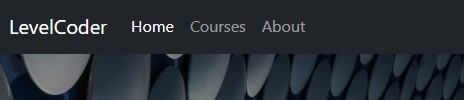
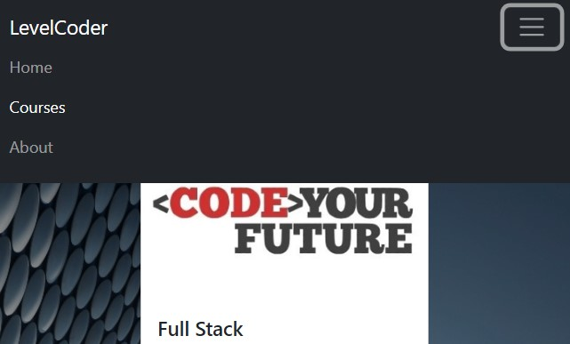

Welcome!

This is a Code Institute student project for Milestone 1, built to satisfy the requirements for the EKC DigitalLearn Diploma (Level 5) in [Web Application Development](https://www.ekcgroup.ac.uk/ekc-digitallearn/computing/web-application-development-diploma). 

## Project Purpose
This project has been created in order to display useful information on a deployed static website. The project was built using **Gitpod**.

The information has been presented in a way that ensures the users achieve their goals of:
* understanding what the site's function is
* finding appropriate technical courses
* being able to subscribe to our newsletter or email queries to us

The site also enhances the owner's goals by:
* paying back to the tech community
* showcasing their skills
* increasing their network
* contributing to the Open Source community

## Project Requirements
* The technologies used were HTML, CSS and **Bootstrap**.
* This static front end project contains three separate pages - Home, Courses and About/Contact
* A Bootstrap menu and footer is used for each page
* This README.md file explains what the project does and the value it provides for the users
* Version control is provided by Git and GitHub
* External code, libraries, templates, images, information, etc. will be listed in the **Credits**, at the bottom of this README.
* This project is deployed via GitHub Pages and the code in a GitHub repository.

<h1 align="center">LevelCoder - West Midlands, UK</h1>

[View the live project here.](https://janet-dev.github.io/ci-project-1-level-coder/)

This is the first LevelCoder site to be created. It's main function is to serve as a one-stop information site for users in the West Midlands of England. The site will provide information on how users can start and maintain their path into a new career in tech. The first area covered will be: courses, local and remote, free and paid, full-time and part-time. 

The site is designed to be responsive and accessible on a range of devices, making it easy to navigate for potential users.

<h2 align="center"></h2>

## User stories
* As a first time user, 
    - I would like to view what is available from the site.
    - I would like to easily find my way around the site.
    - I would like to view the company's social media accounts to see other users experiences.

* As a returning user, 
    - I would like to find out more information about the courses available to me.
    - I would like to find out how to contact the company directly, so that I can ask questions.
    - I would like to connect with the company via their social media.

* As a frequent user, 
    - I would like to see if there are more advanced courses.
    - I would like to subscribe to a newsletter in order to receive current news about the site.
    - I would like to join a community and meet new people.

## Design
* Colour Scheme
    - Bootstrap's own white (#ffffff) text on dark grey (#212529) scheme is used for the navigation and footer sections.
    - Colours white (#ffffff)and dark grey (#212529) are used for text.
    - Orange (#ff8c00) is used as an extra indicator when hovering over links.
* Typography
    - For the home and about pages, Roboto font is used for the main headings for good readability and text contrast when required. This was chosen for best readability. If this font is unavailable, san serif is used as a fallback.
* Imagery
    - The home page features the striking Selfridges Building, which defines Birmingham. This background image is both artistic and futuristic, and is used as the common background throughout the site. It was chosen to be a technical and friendly hero image.
    - On the courses page, each course is listed in it's own Bootstrap card, which features the providers own logo. This is supplied in order to build up trust and to ensure the users know which provider they are directed to from the site.

## Features
This website will initially consist of three visible pages (Home, Courses, About) and one hidden (subscription confirmation)

### Navigation
Navigation bar will be the default responsive Bootstrap one for all pages.
* Desktops 
    - the menu items: LevelCoder branding, Home, Courses, About will be inline and fixed across the top of the screen. The current page will have white text, while others will be in grey.
    - LevelCoder and Home will navigate to index.html, Courses to courses.html and About to about.html.
<h2 align="left"></h2>

* Mobiles - will feature the collapsed Burger navigation, which has a dropdown menu for each of the visible pages and again, the current page will have white text, while others will be in grey.
<h2 align="left"></h2>

### Pages
* Home page - the user will introduced to the site and tempted to explore further. It will feature:
    - Coloured text, which introduces the user to the facilities of the site.
    - A hero image with opacity, to increase the contrast between the background and coloured text. 
    - Some texts will have active links, indicated with overlines (mainly for mobile viewing), to link to the appropriate pages. When these links are hovered over, they will change to white. Links for pages not yet built will be static coloured text. 
<h2 align="left"></h2>

* Courses page - here the user may find courses at all levels to further their objectives. 
    - Bootstrap cards are used to give a uniform display of the course details
        - Each card includes the following information:
            - course provider logo
            - subjects offered 
            - aim of the course 
            - who can apply, 
            - part or full-time 
            - duration 
            - flexibility 
            - location 
            - cost
        - Links are supplied for the course provider and their social media account. These links will become orange when hovered over.
<h2 align="left"></h2>

* About and Contact page 
<h2 align="left"></h2>
The combined About and Contact page will be composed of:

- Information about the site and why it was created.
- Information about the company.
- Form for subscribing to a weekly newsletter. Users will enter:
    - first name (last name is not required as the company does not collect unnecessary user data)
    - email address
    - select the Subscribe button to sign up to a regular email newsletter
    Both will be checked by the standard Bootstrap validation
    - Email link will be accessed via the envelope icon on the footer
<h2 align="left"></h2>

* Confirmation page is only visible on successful sign up to the newsletter
<h2 align="left"></h2>

### Footer
Footers will feature:
* Social media links for Twitter, LinkedIn, TikTok on all pages, accessed vis the appropriate icon. When hovered over they will change to orange.
<h2 align="left"></h2>

* Email us facility accessed via the envelope icon, only on the About page

## Future Features
After asking the advice of the LinkedIn and codebar communities, further features are required:
* how to access career advice, network and where to find jobs
* how to join the tech community
* how to start contributing to open source projects
* where to find free products to use for design, development and deployment

## Wireframes
Here is the original design:
Wireframes as a [PDF](docs/wireframe/wireframe.pdf)

## Technology Used
* HTML5 and CSS3 for building and custom styling the site.
* Wireframes from [Balsamiq](https://balsamiq.com/)
* IDE from [Visual Studio Code](https://code.visualstudio.com/) and built into Gitpod.
* Developer platform from [Gitpod](https://www.gitpod.io/)
* Bootstrap [Version 5.2](https://getbootstrap.com/docs/5.2/getting-started/introduction/)
* Version control from [Git](https://git-scm.com/)
* Project deployment provided by [GitHub Pages](https://pages.github.com/)
* Icon library and toolkit from [Font Awesome](https://fontawesome.com/)
* Online photo editor from [Pixlr](https://pixlr.com/x/)
* Stock photos from [Unsplash](https://unsplash.com/)

## Testing

### Code Validation

### Test Cases

### Bugs Fixed

### Supported Screen Sizes and Browsers

## Deployment

### Gitpod Reminders

To run a frontend (HTML, CSS, Javascript only) application in Gitpod, in the terminal, type:

`python3 -m http.server`

A blue button should appear to click: _Make Public_,

Another blue button should appear to click: _Open Browser_.

To run a backend Python file, type `python3 app.py`, if your Python file is named `app.py` of course.

A blue button should appear to click: _Make Public_,

Another blue button should appear to click: _Open Browser_.

In Gitpod you have superuser security privileges by default. Therefore you do not need to use the `sudo` (superuser do) command in the bash terminal in any of the lessons.

### GitHub Pages

## Credits

A huge thank you to the following people and organisations, because without you, the website would not have been produced in it's present form.

### From the Course
Rachel Furlong - EKC DigitalLearn Course Facilitator
 
Rohit Sharma - Code Institute Mentor

Sample README from [Code Institute](https://github.com/Code-Institute-Solutions/SampleREADME)

### Images

Woman in front of a lit wall by [Josh Hild](https://unsplash.com/@joshhild) on Unsplash

Selfridges Building in Birmingham by [Christian Holzinger](https://unsplash.com/@pixelatelier) on Unsplash

Graffiti from Digbeth in Birmingham by [Creative Nerds](https://unsplash.com/@creativenerds) on Unsplash

